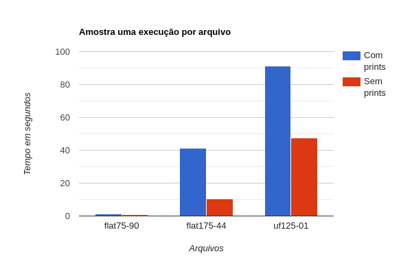
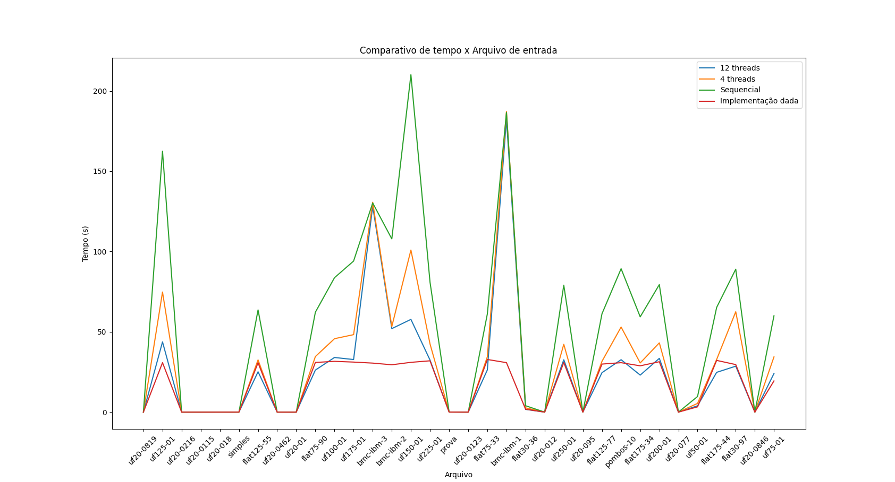
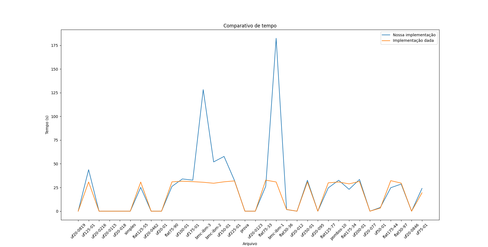
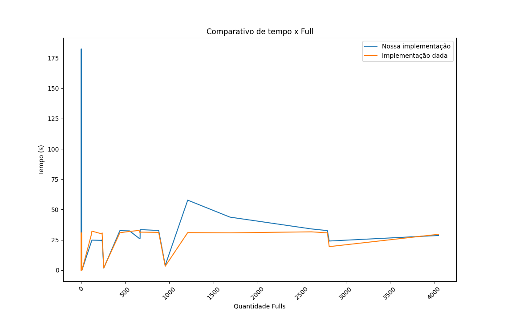

# BCP_PSPD

## Como usar

* Para escolher o número de threads que serão usadas pelo programa modifique a constante `MAX_THREAD` localizada no início do arquivo src/main.cpp.

* Na pasta base do projeto rode o seguinte comando para compilar o programa:
`make`

* Para executar o binário, execute o comando:
`./bin/prog`

## Análise

Gere um relatório simples contendo gráficos de desempenho para as diversas execuções
Coloque a comparação da sua solução com a implementação sequencial fornecida;
Avalie o gargalo do seu algoritmo
### O maior problema acontece nas estruturas de controle (ex:semáforos)?

Não. O maior gargalo é no processamento, quando o número de threads do programa é igual ao do computador.

### O tempo de leitura da entrada é perceptível?

Sim. Em entradas grandes é perceptível.

### Isole o tempo de execução da função que avalia a verificação (descontando o tempo de leitura da fórmula e de cada valoração full e flips)

Amostra de uma execução por arquivo com 4 threads.
Com prints:
* flat75-90: 1.111s
* flat175-44: 41.053s
* uf125-01: 1m31.291s

Sem prints:
* flat75-90: 0.808s
* flat175-44: 10.451s
* uf125-01: 47.423s

 

### Qual é a complexidade do seu verificador?

Com as seguintes variáveis:
f = número de fulls
fl = número de flips
c = número de cláusulas
v = número de variáveis

O(f ((c v)+(fl+1)(c c + v c) + fl (v log(v)))))

### O seu algoritmo aproveita resultados parciais para avaliar flips mais rapidamente?

Sim. Para cada flip, é feito uma "nova versão" das clausulas, e para cada variável tida como verdadeira é diretamente feita uma valoração verdadeira as suas clausulas para que não sejam reavaliadas nessa "versão".

### Resultados

Comparação dos resultados tendo em vista algumas quantias de threads.

Melhor desempenho

Comparativo com nosso foco de paralelização

